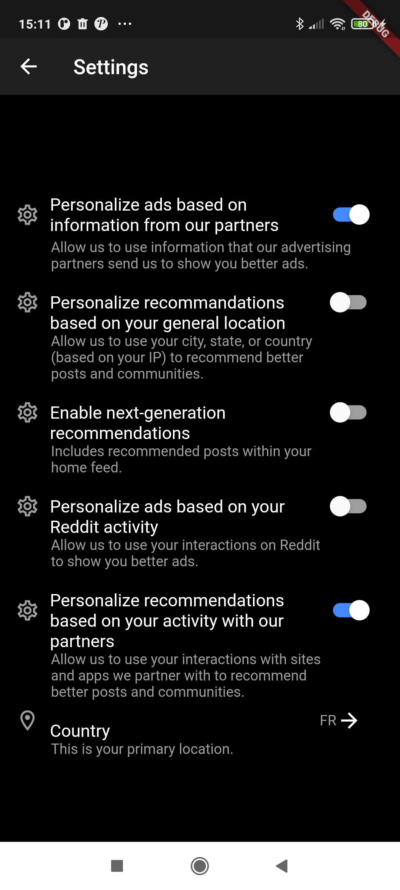

# redditech

A reddit like application using the reddit API.

The goal of this project is to use the reddit API to implement features using the reddit API like : Login using reddit OAuth, subscribe to subreddits, search for subreddits, eddit users settings, etc.

# Dependencies

- Flutter
- Android SDKs

# Usefull vscode extensions
- dart-code.dart-code
- dart-code.flutter

# Testing policy
### How to test
- Go to `test/`
- Run the tests using the command `flutter test`

### How to add tests
- Go to `test/`
- Edit `widget_test.dart` file and start writing your tests

### See also
- https://flutter.dev/docs/testing
- https://pub.dev/packages/test

# How to launch a debug version
- Option1 : Open the project inside Android Studio and install all flutter related dependencies, then run the app with the debug mode
- Option2 : Open the project inside visual studio and install all usefull flutter related extensions, then connect either a physical device or emulator and run the app with the debug mode

- You may need to run `flutter get` to install the dependencies

_______________________________
# Characteristics

## Connection :
***

## See posts from subreddits you are subbed to
***

## Search for subreddits, see their description and their posts + subscribe or unsubscribe to them
***

## See your profile
***

## Update your settings
***

